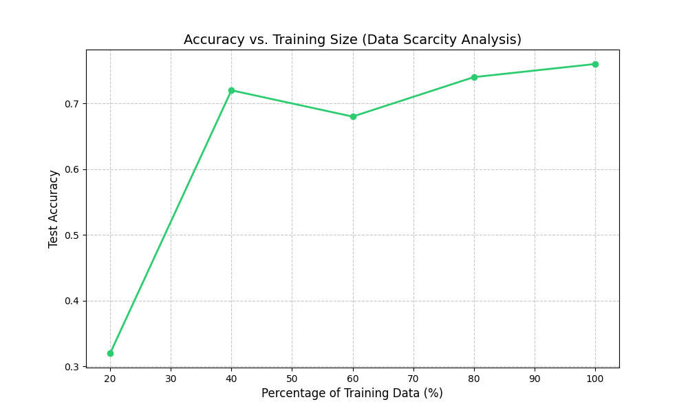
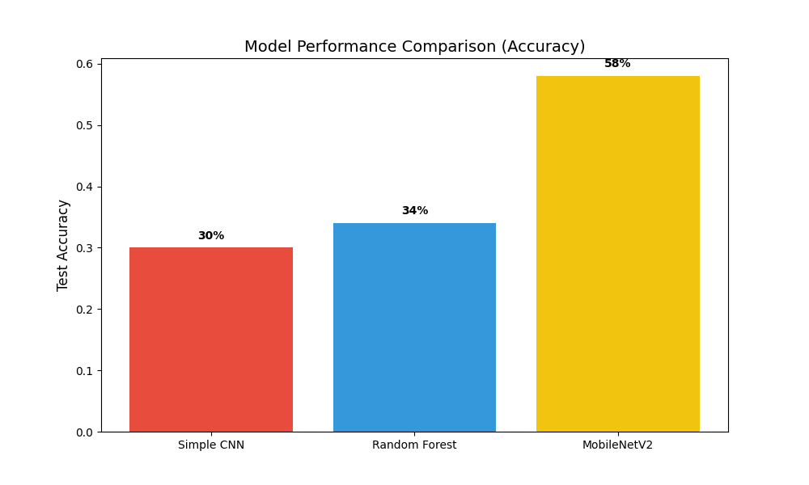

# 📊 Model Performance Analysis: Dealing with Data Scarcity

This repository documents the research and evaluation phase of the Cattle Breed Recognition project. Best-performing model deployed in the functional application repository.

## 📈 Data Scarcity Analysis
Controlled experiments were conducted to evaluate model performance under varying data availability. Results confirm that **data scarcity is a primary bottleneck** in niche classification tasks.

*Key Insight: Training on even 40% more data yields significant jumps in F1-score.*

## 📊 Model Comparison
We compared three approaches: a baseline Random Forest, a Simple CNN from scratch, and a MobileNetV2 with Transfer Learning.

| Model | Accuracy | Parameters | Verdict |
| :--- | :--- | :--- | :--- |
| **MobileNetV2 (Transfer)** | **58%+** | 2.6M | **Winner** |
| Random Forest + Pixels | 34% | N/A | Baseline |
| Simple CNN (Scratch) | 30% | 44M | Overfits |

## 📄 Key Findings
For a deep dive into why transfer learning dominates in low-data environments, see [key_findings.md](key_findings.md).

---
*Research conducted as part of SIH2025.*
